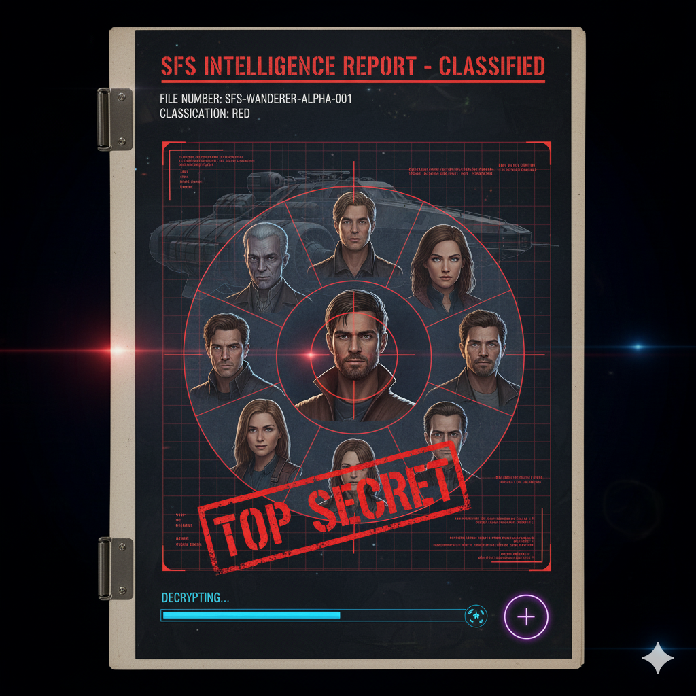

# The Wandering Verse — Community Hub

	

Welcome to the official hub for **The Wandering Verse: A Legacy Debugger's Handbook**, a story-first TTRPG from Synapse Comics. This site is your gateway to the Verse—download the handbook, join the crew, and help shape the future of collaborative storytelling.

---

## 🚀 Live Site
[Play & Explore](https://lxdangerdoll.github.io/the-crucible-ignites/)

---

## ✨ Features
- **One-Click Handbook Access:** Download the latest PDF for free.
- **Interactive Feedback:** Cast your vote on story points and mechanics—your input shapes the canon.
- **Crew Dossier Viewer:** Modal-based profiles for all crew and ships.
- **Lightweight & Fast:** Pure HTML, CSS, and vanilla JS. No frameworks, no build tools.

---

## 🛠️ Usage
Clone or download the repository, then open `index.html` in your browser.

---

## 🚢 Join the Crew & Support Us

Share your stories, art, and feedback in our [Forgotten Library Discord](https://discord.gg/bKEQuzueM4). Find a crew, contribute code, or just hang out and shape the Verse together.

---

## 📝 Contributing & Feedback
- Use the "Cast Your Vote" form on the live site
- Fork the repo and submit pull requests for improvements
- Playtest, share feedback, and help us refine the game

---

## 🎨 Credits
**Project:** Synapse Comics, Project Keystone  
**Art, Writing, and World:** Mercy Danger & The Crew

---

## 📜 License
MIT